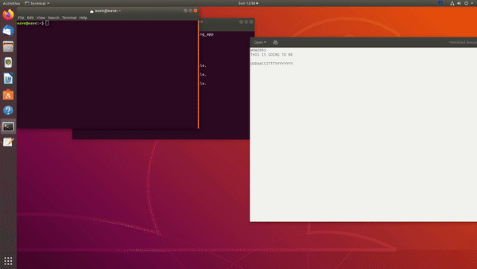

# Screen Event Capturer
This project records the computer screen and waits for an event to occur, once the event occurs the program will then save a video file with footage of the event occuring.

To prevent an indefinately long video, the user selects a duration for the video. Two streams are repeatedly ran in parallel for the durtion of the video.

The two streams are 50% overlapping where one stream's first half is recording along with the other streams second half and vice versa.

When the event occurs the program checks which stream is in the center half and saves that file while discarding all other files.



## Build Instructions

Install cmake and git

```
sudo apt install cmake git
```

clone repo and change directories into the repo
```
git clone https://github.com/Abdob/Screen-Event-Capturer
cd Screen-Event-Capturer
```
Install Gstreamer using the script provided

```
sudo ./install_gstreamer.sh
```

create a build directory, cd into it and build using cmake

```
mkdir build
cd build
cmake ..
make
```

## Run Instructions
Run the program

``` 
./screen_recording_app
```

Enter a duration in seconds as prompted and allow the recording to happen.

When ready to stop, open a separate terminal induce an event by creating an event file on the same directory where the program is ran

```
cd Screen-Event-Capturer/build
touch event
```

## File and Class Structures
The two classes used are ```VideoRecorder``` and ```RecordManager```. In total there are five C++ files:
```
VideoRecorder.cpp
VideoRecorder.hpp
RecordManager.cpp
RecordManager.hpp
main.cpp
``` 

The main file initializes gstreamer and instantiates a ```RecordManager``` object and initializes to start the recording with Video```1```.

The ```RecordManager``` class is responsible for getting the duration from the user, launching two recording threads in parrallell and synchronizing between the threads. The ```RecordManager``` class instantiates a ```VideoRecorder``` object each time a Video is started, twice per video duration and tells the ```VideoRecorder``` when to start and stop recording and if it needs to save the file.

The ```VideoRecorder``` class sets a gstreamer pipeline to capture images from the screen and record them into a video file. It is responsible for creating and deleting or saving the video files.


